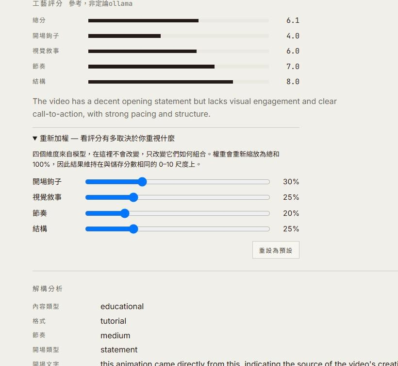
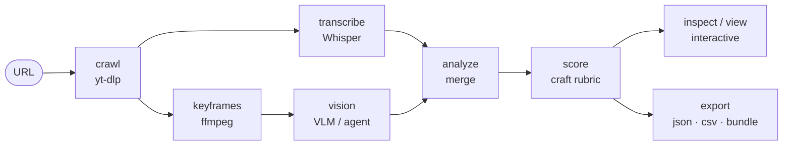

# Reel Scout

> English ｜ [繁體中文](README.zh.md)

Short-form video analysis CLI tool.

Crawl, transcribe, and visually analyze YouTube Shorts, Instagram Reels, and TikTok videos into structured data.



## How it works



Keyframes are ffmpeg, not a model, so the frames exist before any model runs — which
is why an **agent** can stand in for the VLM/score stage when no local model is
present (the **L1** tier). Craft scores are a *reference*, not a verdict.

## Install

```bash
pip install reel-scout
reel-scout skill install       # only if you drive it from Claude — see below
```

`ffmpeg` must be on PATH (macOS: `brew install ffmpeg`). `yt-dlp` comes with the
package. Extras: `whisper` (faster-whisper transcription), `audio` (audio events
+ BPM), `ocr`, `diarize`, `instagram` — e.g. `pip install "reel-scout[whisper]"`.

### Using it from Claude

`pip install` gives you the CLI. The **skill** is the half an agent reads:
`SKILL.md` (the pipeline procedure and the capability/surface matrix), the `/scout` slash
command, and the reverse-decode `prompts/`. `reel-scout skill install` copies
them to `~/.claude/skills/reel-scout` (`--dest` to put them elsewhere, `--force`
to overwrite). Restart Claude Code, then:

```
/scout https://www.instagram.com/reel/XXXXXXXX/
```

`reel-scout skill path` shows where the assets are being read from.

**No local model?** You do not need one. Keyframe extraction is ffmpeg, so the
frames exist before any model runs — the skill's **L1** tier has the agent
describe them and apply the craft rubric itself, then writes that back with
`reel-scout ingest`. No API key, no cloud, no GPU. See `SKILL.md`.

From a clone, for development:

```bash
pip install -e ".[dev]"
```

## Usage

```bash
reel-scout crawl "https://youtube.com/shorts/xxxxx"
reel-scout analyze "https://youtube.com/shorts/xxxxx"
reel-scout analyze --file urls.txt --skip-vision
reel-scout list
reel-scout show <video_id>
reel-scout inspect <video_id>          # interactive single-clip inspector web app
reel-scout export --format json -o ./export
reel-scout config check
```

`inspect` starts a small local web app for one clip and opens it in the browser.
The **video player is the single source of truth**: a **waveform** (ffmpeg peaks,
cached) with a click-to-seek playhead, a **keyframe filmstrip**, and the
**transcript** all seek the player and highlight as it plays. Set **IN/OUT**
markers on the waveform and export the trimmed window as SRT. Needs the downloaded
video file on disk. (Design ported from arkiv's live inspector.) `export --format
html` remains the offline multi-clip bundle; `view` is the read-only browsing
server.

**Craft scores are a reference, not a verdict — and the page shows why.** The four
dimensions come from a model, and the same clip scores differently across models,
so the number is never the point. A collapsed **re-weight** panel lets you drag the
weighting of the four dimensions and watch `overall` recompute live, your blend
beside the stored default. The dimensions themselves never move — only how they are
combined — so you can see exactly how much the verdict depends on what *you* value.

**Interface language toggle (EN / 中文).** The inspector and the read-only `view`
carry both English and Traditional Chinese in the page: an instant client-side
switch that follows your browser's language on first load and remembers your
choice. Only interface labels translate — the model's own output (transcript,
descriptions, decoded values) is left exactly as produced. (This is the *interface*
language; for bilingual *audio* transcription, see the section below.)

## Bilingual / code-switching audio (中英對照)

Whisper `large-v3` locks onto the language it detects in the opening window and, on
long files, "translates" later speech of the *other* language back into the locked
one — a code-switching interview (Chinese host + English guest) comes out with the
guest's English mangled into garbled Chinese. It is a long-form drift, not a bad
audio issue: the same passage transcribes perfectly when sliced out on its own.

Fix — force per-chunk language re-detection:

```bash
WHISPER_MULTILINGUAL=1 WHISPER_CHUNK_LENGTH=15 reel-scout analyze "<url>"
```

`multilingual` alone is not enough — it needs a short `chunk_length` (~15s) so each
chunk re-detects. Verified on a 40-min ZH-host/EN-guest interview: latin-char
recovery 56% → 90%. Leave OFF for single-language short-form (per-chunk detection
adds cost). Other levers: `WHISPER_LANGUAGE=en` (force one language),
`WHISPER_TASK=translate` (force English output).

## MCP Server

An agent can drive the whole pipeline over MCP — no shell needed.

```bash
reel-scout mcp install    # register the server in the client's config (no hand-editing JSON)
reel-scout mcp path       # show where it's registered
reel-scout-mcp            # or run it directly (stdio transport)
```

Tools cover both sides: **read** — `list_videos`, `show_video`, `get_transcript`,
and a `keyframes` tool so an agent with no filesystem can still see the extracted
frames; **write** — `ingest` (vision / score / analysis), a background `batch`, and
`inspect`. This is how the **L1** tier works: an agent that can see images supplies
the visual layer and craft score itself, so results land in `show` / `view` /
`inspect` / `export` instead of a chat log.

## Prompt Pack (analysis layer)

Reel Scout's pipeline gets clean input into a model. The **reverse-decode prompt
pack** in [`prompts/`](./prompts/) is the analysis brain you point at that input —
to reverse-engineer *why* a short-form video works and extract a transferable
structure, with anti-hallucination guardrails (observation vs. inference, cite the
timestamp). Open (MIT). See [`prompts/README.md`](./prompts/README.md).

## Requirements

- Python 3.9+
- ffmpeg
- yt-dlp

## Attribution

Video extraction techniques (captions-first transcription, duration-aware frame
budgeting, time-range focus, on-screen-text resolution bump) are adapted from
[claude-video](https://github.com/bradautomates/claude-video) (MIT). See [`NOTICE`](./NOTICE).
