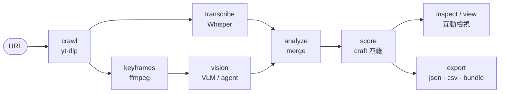

# Reel Scout

> [English](README.md) ｜ 繁體中文

短影音拆解 CLI 工具。

把 YouTube Shorts、Instagram Reels、TikTok 影片（以及一般長影片）**下載 → 轉錄 → 視覺分析 → 合併 → 評分**，輸出成結構化資料。

---

## 這是什麼

一條把影片變成可分析資料的 pipeline，全部在本機跑（也可接雲端模型）：




1. **crawl** — 用 yt-dlp 下載影片
2. **transcribe** — faster-whisper 逐字轉錄（含時間碼）
3. **vision** — 抽關鍵幀、用 VLM 描述畫面（關鍵幀是 ffmpeg 不是模型，所以無本機模型時可由 **agent** 代打 = L1）
4. **merge** — 用 LLM 把轉錄 + 視覺合併成結構化分析（hook / 主題 / 風格 / engagement）
5. **score** — LLM 對 craft 四維（hook / 視覺敘事 / 節奏 / 結構）評分（**參考，非判決**）

資料存在本機 SQLite（`data/reel_scout.db`），可再 export 成 JSON / CSV / 向量庫。

---

## 安裝

```bash
pip install reel-scout
pip install "reel-scout[whisper]"   # faster-whisper 轉錄（建議一起裝）
```

需要 `ffmpeg` 與 `yt-dlp`（Mac：`brew install ffmpeg yt-dlp`）。
其他 extras：`audio`（音訊事件 + BPM）、`ocr`、`diarize`、`instagram`。

從 clone 開發用：

```bash
pip install -e ".[dev]"
```

---

## 快速開始

```bash
reel-scout config check                              # 檢查環境（ffmpeg / yt-dlp / 後端是否連得到）
reel-scout analyze "https://youtube.com/shorts/xxx"  # 跑完整 pipeline
reel-scout show <video_id>                           # 看完整拆解結果
```

### 常用指令

| 指令 | 用途 |
|------|------|
| `browse` | 列出某頻道／個人頁的影片清單 |
| `crawl` | 只下載影片，不分析 |
| `analyze` | 完整 pipeline（crawl + transcribe + vision + merge）|
| `transcribe` | 只轉錄本機影片／音檔 |
| `vision` | 只抽關鍵幀 + VLM 描述 |
| `score` | 對已分析影片做 LLM 評分 |
| `list` / `show` | 列出 / 檢視已分析影片 |
| `inspect` | 單支影片的互動檢視 web app（播放器 + 波形 + 關鍵影格 + 逐字稿）|
| `view` | 唯讀瀏覽伺服器（影片庫列表）|
| `export` | 匯出分析（JSON / CSV / 向量庫 / 自包含 bundle）|
| `config` | 設定與環境檢查 |

`inspect` 開一個本機 web app：**播放器是唯一真相來源**，波形、關鍵影格、逐字稿全部跟著播放跳轉。兩個 v1.3.0 的重點：

- **工藝評分是參考、不是判決 —— 介面自己說明白。** 四維分數來自模型、同一支影片跨模型會飄，所以數字從來不是重點。收合的**重新加權**面板讓你拖四維的比重、`overall` 即時重算（你的比重 vs 預設）。四維本身不動，只改「怎麼組合」，你就看得到評分有多取決於**你**重視什麼。
- **介面中英切換（EN / 中文）。** inspector 與 `view` 兩本字典都在頁面裡，即時切換、自動跟瀏覽器語言、記住選擇。**只翻介面標籤**，模型產出（逐字稿／描述／decoded 值）原樣保留。（這是**介面**語言；音訊的中英對照轉錄見上面「中英對照訪談」段。）

常用旗標：

```bash
reel-scout analyze --file urls.txt --skip-vision   # 批次跑、跳過視覺分析（省時）
reel-scout analyze "<url>" --score                 # 跑完順便評分
reel-scout analyze "<url>" --resume                # 續跑中斷的批次
```

---

## 中英對照訪談（重要）

whisper `large-v3` 會**用開頭那段偵測到的語言鎖定整支影片**。跑長的中英夾雜訪談（中文主持 + 英文來賓）時，它會把後面**另一種語言**的內容硬「翻譯」回鎖定的語言 —— 來賓的英文就變成一堆亂碼中文。

這是**長檔語言漂移**，不是音檔壞掉：同一段單獨切出來轉，英文完全正常。

**解法** —— 強制每段重新偵測語言：

```bash
WHISPER_MULTILINGUAL=1 WHISPER_CHUNK_LENGTH=15 reel-scout analyze "<url>"
```

- 光開 `multilingual` **不夠**，一定要配短 `chunk_length`（約 15 秒），每段才會重新偵測。
- 實測一支 40 分鐘中主持／英來賓訪談：英文字母還原率 **56% → 90%**，原本亂碼的段落全部變回乾淨英文。
- **單語短影音維持關閉**（每段重偵測會增加成本，預設就是關的）。

其他語言旋鈕：

| 環境變數 | 效果 |
|----------|------|
| `WHISPER_LANGUAGE=en` | 強制單一語言 |
| `WHISPER_TASK=translate` | 一律輸出英文（不管原音）|
| `WHISPER_MULTILINGUAL=1` | 每段重新偵測語言（中英對照用）|
| `WHISPER_CHUNK_LENGTH=15` | 搭配 multilingual 的分段長度（秒）|

> 需要 `faster-whisper >= 1.1`（`multilingual` 參數自 1.1 才有）。

---

## 後端選擇

`merge` 與 `score` 需要一個 LLM／VLM 後端：

- **本機**：Ollama（`OLLAMA_BASE_URL`）或 oMLX（`OMLX_BASE_URL`）—— 免費、離線、要一張夠力的卡或 Apple Silicon。
- **雲端／代理**：Claude、Gemini、OpenClaw proxy（`OPENCLAW_BASE_URL`）—— 無需本機 GPU。

設定走 `.env`（複製 `.env.example` 再改）。跑 `reel-scout config check` 看目前解析到的設定。

---

## 接 Claude Code（MCP）

agent 可以完全走 MCP 驅動整條 pipeline，不用敲 shell。

```bash
reel-scout mcp install    # 把 server 註冊進 client 設定（免手改 JSON）
reel-scout mcp path       # 看註冊在哪
reel-scout-mcp            # 或直接跑（stdio transport）
```

工具涵蓋兩側：**讀** —— `list_videos`、`show_video`、`get_transcript`、以及 `keyframes`（讓沒有檔案系統的 agent 也看得到抽好的關鍵幀）；**寫** —— `ingest`（vision／score／analysis）、背景 `batch`、`inspect`。這就是 **L1** 的運作方式：一個看得到圖的 agent 自己補上視覺層與工藝評分，結果落進 `show` / `view` / `inspect` / `export` 而不是聊天記錄。

---

## 硬體需求（本機自跑模型）

模型是**逐階段依序載入**、不同時佔用，峰值卡在文字 LLM，所以 VRAM／統一記憶體是瓶頸：

| 階段 | 模型 | 約略大小 |
|------|------|----------|
| 轉錄 | faster-whisper large-v3 | ~3 GB |
| 關鍵幀 VLM | minicpm-v（~5.5 GB）或 llava:7b（~4.7 GB）| ~5 GB |
| 合併 + 評分 LLM | qwen2.5:14b | ~9 GB |

> 參考：一支短影音（下載 → whisper large-v3 → 關鍵幀 → VLM → 合併 → 評分）在 RTX 4070（12 GB）約 **9–10 分鐘**，whisper + VLM 最吃時間。**一次跑一支**，並行會把顯卡打爆、VLM 逾時。

**建議**（跑滿血模型順暢）：
- NVIDIA：≥12 GB VRAM（RTX 4070 / 3080 級）+ 32 GB RAM + SSD
- Apple Silicon：M2 Pro / M3 Pro+，32 GB 統一記憶體

**最低**（小模型／較慢）：
- NVIDIA：8 GB VRAM（RTX 3060 / 4060）→ 用 qwen2.5:7b + llava:7b/minicpm-v + whisper medium；16 GB RAM
- Apple Silicon：M1 / M2，16 GB 統一記憶體
- 純 CPU：能跑，但 whisper + LLM 很慢 —— 只適合批次／過夜，不適合即時

沒有 GPU？走雲端後端（Claude / Gemini / OpenClaw proxy）以上都不需要。

---

## 授權

MIT —— 個人與商業使用皆免費。
